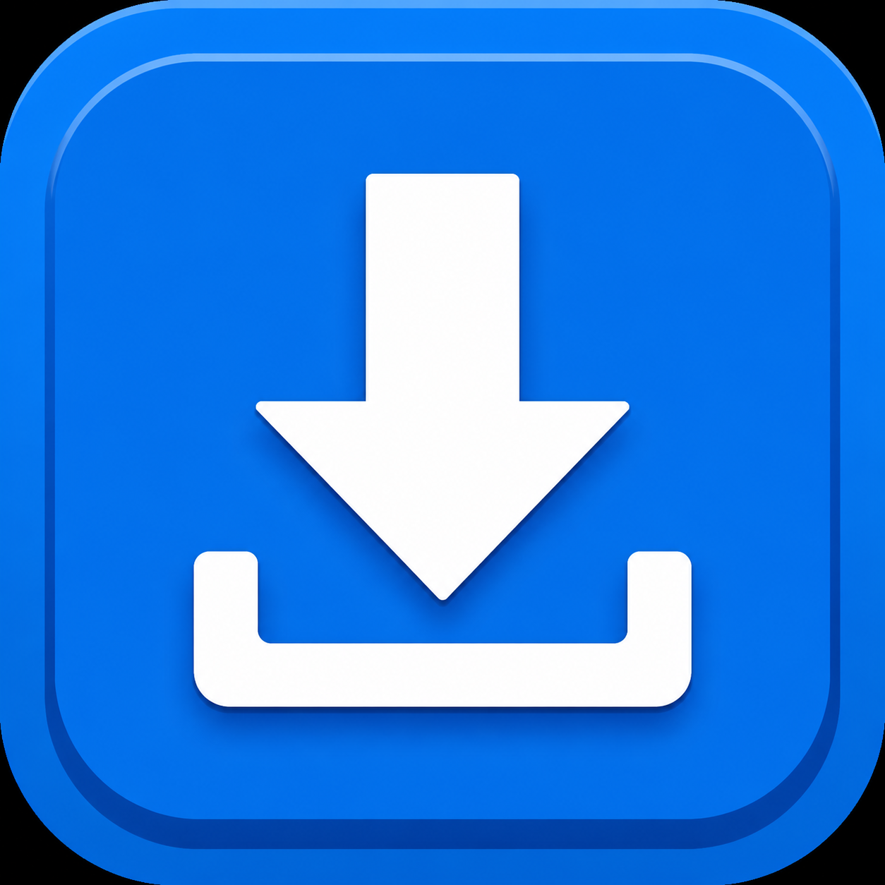

<div align="center">



# Velocity - Download Manager

**Лёгкий portable download manager для Windows 11**

[](https://github.com/NEONARCHY/Velocity-Download-Manager/releases/latest)
[](https://github.com/NEONARCHY/Velocity-Download-Manager/actions/workflows/build.yml)
[](LICENSE)

Несколько загрузок одновременно, до 16 соединений на файл, пауза и продолжение — в аккуратном Fluent-интерфейсе.

[Скачать portable EXE](https://github.com/NEONARCHY/Velocity-Download-Manager/releases/latest) · [Сообщить об ошибке](https://github.com/NEONARCHY/Velocity-Download-Manager/issues/new?template=bug_report.yml)

</div>


## Возможности

- Одновременная загрузка нескольких файлов.
- 1, 4, 8 или 16 соединений на файл; в режиме «Авто» используется 8.
- Пауза и продолжение загрузки, в том числе после перезапуска приложения.
- Автоматический переход на один поток, если сервер не поддерживает загрузку частями.
- Диагностика текущей и пиковой скорости, загрузки интернет-тарифа и вероятного лимита сервера.
- Временные части хранятся отдельно от папки загрузок — Проводник не дёргается во время записи файла.
- Кэш автоматически удаляется после завершения или удаления незаконченной загрузки.
- Один автономный `.exe`: установка и отдельный .NET Runtime не нужны.

## Быстрый старт

1. Скачайте `Velocity-Download-Manager-v2.4.1-portable.exe` из [последнего релиза](https://github.com/NEONARCHY/Velocity-Download-Manager/releases/latest).
2. Запустите файл, вставьте одну или несколько прямых HTTP/HTTPS-ссылок.
3. Выберите папку и нажмите **«Добавить»**.

> Приложению нужна именно прямая ссылка на файл. Страницы сайтов, ссылки с обязательной авторизацией, cookies или CAPTCHA могут не работать.

## Скорость и ограничения серверов

Velocity - Download Manager использует доступную пропускную способность соединения и многопоточную загрузку, когда сервер её разрешает. Приложение не обходит ограничения скорости, установленные сервером, аккаунтом, провайдером или Wi‑Fi. Диагностическая строка помогает понять, где вероятнее всего находится ограничение.

## Кэш и приватность

Незавершённые данные находятся в `%LOCALAPPDATA%\VelocityDownload\Cache`. После успешной загрузки временные файлы удаляются автоматически. Кнопка `×` удаляет выбранную задачу вместе только с её кэшем; обычная пауза сохраняет данные для продолжения.

Приложение не содержит телеметрии и не отправляет историю ссылок сторонним сервисам.

## Сборка из исходников

Требуются Windows и [.NET 10 SDK](https://dotnet.microsoft.com/download/dotnet/10.0).

```powershell
dotnet restore
dotnet build -c Release
dotnet publish -c Release -r win-x64 --self-contained true -p:PublishSingleFile=true -p:IncludeNativeLibrariesForSelfExtract=true -p:EnableCompressionInSingleFile=true
```

Готовый файл появится в `bin/Release/net10.0-windows/win-x64/publish/`.

## Проверка файла

Для официального portable EXE версии 2.4.1:

```text
SHA-256: AC0B9D7E0AE8AA640F9D27940BF40F0C950C70A154058330A582FD25C5811ADB
```

```powershell
Get-FileHash .\Velocity-Download-Manager-v2.4.1-portable.exe -Algorithm SHA256
```

## Лицензия

Исходный код распространяется по лицензии [MIT](LICENSE).
